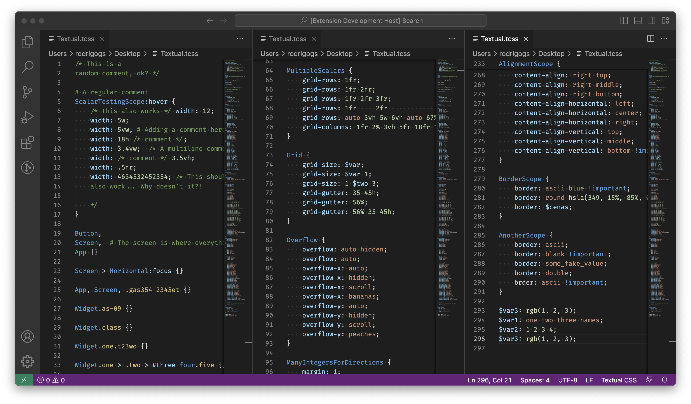

# Textual CSS Syntax Highlighter

## Features

Does syntax highlighting for Textual CSS files (files with the extension `.tcss`).

## Known Issues

This extension does not support highlighting variables or selectors.

## Release Notes

### 0.1.0

Initial release.
